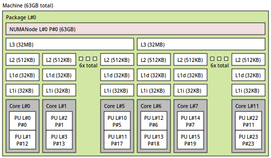
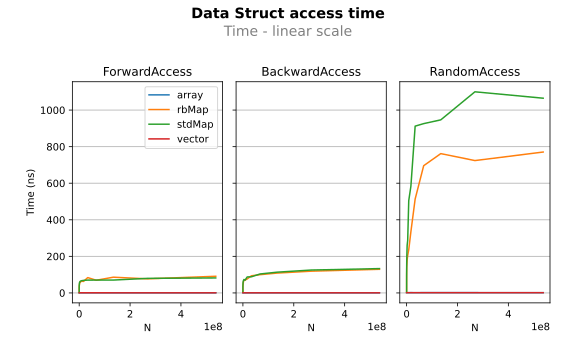
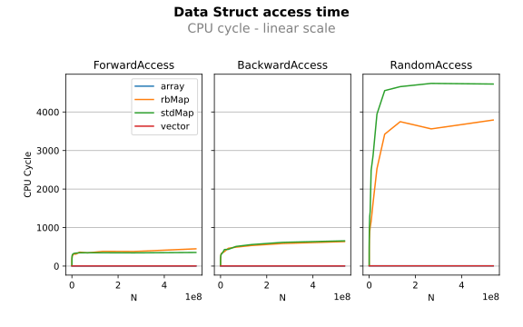
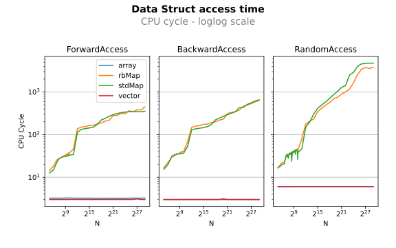
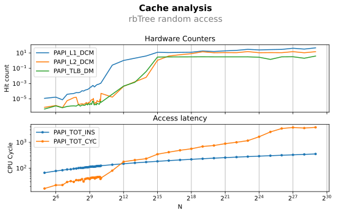

Trees are O(ln(n)) and tend to be widely used. But how much time do we loose by using them?

## Hardware description

* AMD Ryzen 5900x 12-Core @3.7GHz (zen3, up to 4.951GHz)
* 2x 32GB-DDR4-ECC-unbuffered (PN: 9965745-020.A00G)




## μBench list

### Arrays (malloc())

``` cpp
typedef uint32_t E;
E *aTest = (E*)malloc(max * sizeof(E));
```

### Vectors (std::vector)

``` cpp
typedef uint32_t E;
std::vector<E> vecTest;
```

### Red-Black tree (std::map)

``` cpp
typedef uint32_t E;
std::map<E, E> mapTest;
```

### Red-Black tree (optimized)

* Switch from 64b pointers to 32b array indexes
* No support variable length keys and payload (eg: strings)
* Room for improvement:
    * use 31b indexes to save 1 bit for the color (and 1 byte per element)

### B-tree

!!! todo
    Should reduce the number of memory jumps

## Step By Step Analysis

## Timing comparison



Observations:

* The curves are looking *logarithmic*
* The access pattern matters
* The random accesses are noisy and slower by magnitude orders

## CPU cycle comparison



Observations:

* Same results (the system is was not loaded)
* It's easier to see that with Trees, the efficiency is lower than 1%

## CPU cycle in loglog scale



Observations:

* Cache effects are clearly shown
* Vector/Array random accesses are slower
    * it's due to the benchmark implementation
    * a better one (and a larger one) should also show cache effects

## Hardware counters



Observations:

* L2 influence from ~2^10 to 2^15
* The bump from 2^24 to 2^27 might be due to the L3 (I failed to retrieve the L3 misses from this CPU)


## Summary

|                    | size per element | access latency (nsec) | access latency (cycle) |
|--------------------|------------------|-----------------------|------------------------|
| array              | 4B               | 1.392                 | 6.029                  |
| vectors            | 4B               | 1.362                 | 6.029                  |
| rb-tree (std::map) | 48B              | 1099.96               | 4742.51                |
| rb-tree (custom)   | 21B              | 770.55                | 3791.34                |
| b-tree (abseil)    |                  |                       |                        |
| b-tree (custom1)   |                  |                       |                        |
| b-tree (custom2)   |                  |                       |                        |
| b-tree (custom3)   |                  |                       |                        |
